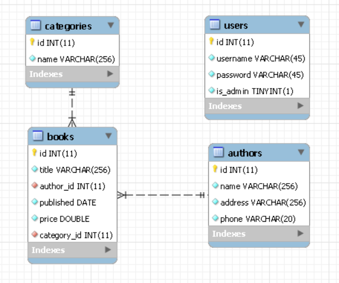

# Bookstore

The project implements different types of operations with books, authors and book categories. There are two types of user roles: ordinary and administrator.
Ordinary users can view all the available books and their details, while admins can view all books, authors and categories,
and also do all the CRUD operations with them. There is also a simple login and registration system via which ordinary users can be 
created or accessed. Users with admin role cannot be created through the app, so the login credentials for the sample admin are:
> username: adminuser
>
> password: Password123 

The GUI implementation of the app can be used by running the following commands:
```shell
mvn clean install
mvn clean javafx:run
```

The CLI implementation of the app can be built and used by running the following commands:
```shell
mvn clean install -P cli-app
java -jar target\bookstore-cli-jar-with-dependencies.jar
```

The project documentation can be generated by running the following command: 
```shell
mvn clean javadoc:aggregate
```

Database schema used in the project:

<center></center>